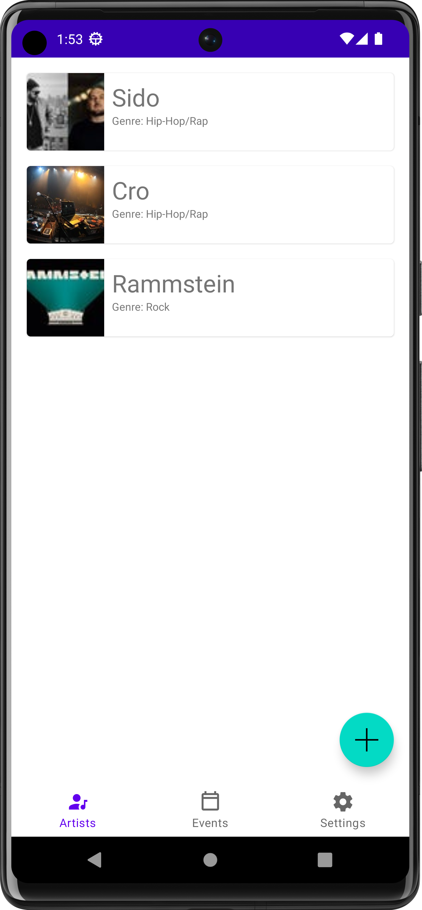
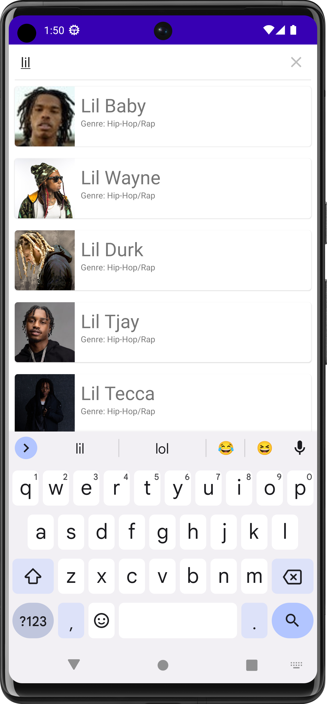
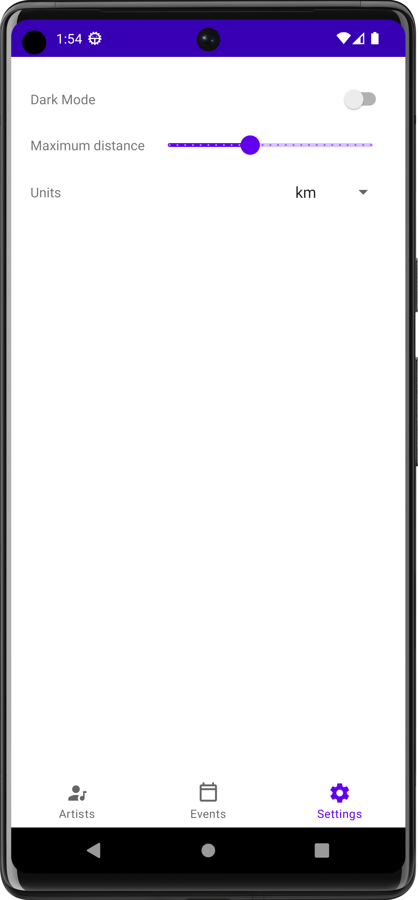
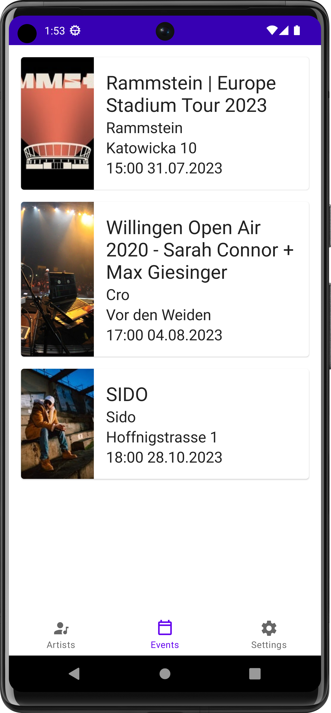
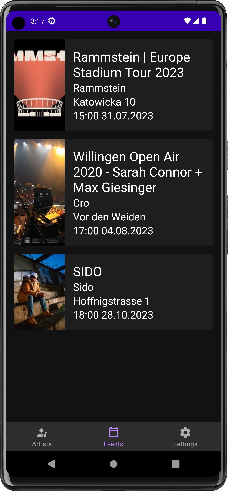
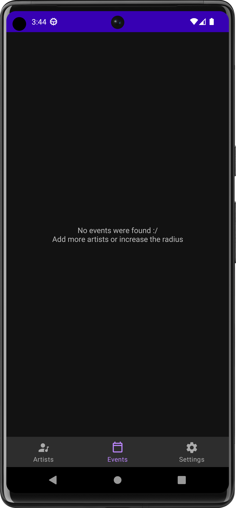

# Unsere App für das Testat in MGE

## Idee
Die App soll anstehende Konzerte von eigenen Lieblingskünstlern in einem definierten Umkreis anzeigen.

## Funktionen
- Künstler zu Favoritenliste hinzufügen / entfernen
- Anstehende Konzerte von Künstlern in der Favoritenliste anzeigen
- Konfiguration des gewünschten Umkreises, in dem nach Konzerten gesucht werden soll
- Den Darkmode ein- und ausschalten

## Screenshots

	
	
	

 

	
	
	

## Erwartete Punke

<table>
	<thead>
		<tr>
			<th>Feature</th>
			<th>Erwartere Punktzahl</th>
		</tr>
	</thead>
	<tbody>
		<tr>
			<td>Verwendung von Kotlin statt Java</td>
			<td>9 / 9 (3 Teammitglieder)</td>
		</tr>
		<tr>
			<td>Funktionalität: Künstler suchen / hinzufügen / löschen</td>
			<td>5 / 5</td>
		</tr>
		<tr>
			<td>Funktionalität: Suchradius für Events konfigurierbar</td>
			<td>3 / 5</td>
		</tr>
		<tr>
			<td>Persistenz</td>
			<td>3 / 3</td>
		</tr>
		<tr>
			<td>Verwendung von Webservices</td>
			<td>3 / 3</td>
		</tr>
		<tr>
			<td>Verwendung von Aktoren oder Sensoren: Geolocation</td>
			<td>2 / 2</td>
		</tr>
		<tr>
			<td>Ressource: Unterschiedliche Styles (Dark-Theme)</td>
			<td>2 / 2</td>
		</tr>
		<tr>
			<td>Jetpack-Komponente: RecyclerView</td>
			<td>3 / 3</td>
		</tr>
		<tr>
			<td>Jetpack-Komponente: SearchView</td>
			<td>3 / 3</td>
		</tr>
		<tr>
			<td>Jetpack-Komponente: Room</td>
			<td>3 / 3</td>
		</tr>
		<tr>
			<td>Integration von Drittkomponenten</td>
			<td>2 / 3</td>
		</tr>	
		<tr>
			<td>Gesamtpunktzahl</td>
			<td>38</td>
		</tr>
	</tbody>
</table>
